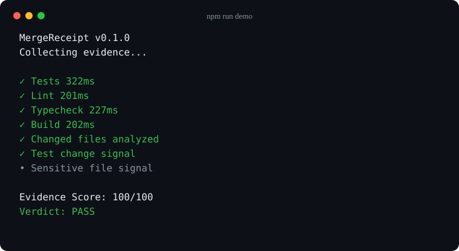

# MergeReceipt

[](https://www.npmjs.com/package/mergereceipt)
[](https://www.npmjs.com/package/mergereceipt)
[](https://github.com/rfedosov/mergereceipt/actions/workflows/ci.yml)
[](https://github.com/rfedosov/mergereceipt/actions/workflows/codeql.yml)
[](LICENSE)

**Evidence before merge.**

MergeReceipt collects reproducible verification signals for pull requests
before review or merge. It runs repository checks, inspects the real git change
set, and produces one evidence report for humans and CI.

Coding agents can say that tests pass, the build works, and a change is ready.
**Claims are not evidence.** MergeReceipt runs the configured checks and shows
what was actually observed.

It does not detect bugs with AI, guarantee safe code, or replace human review.
It works without an account, hosted service, API key, or telemetry.



## Try it in 60 seconds

Requires Node.js 20 or newer and a git repository.

```bash
npm install --save-dev mergereceipt
npx mergereceipt init
npx mergereceipt verify
```

- `init` detects common npm scripts and creates `.mergereceipt.yml`. It never
  replaces an existing config unless `--force` is supplied.
- `verify` runs those checks, compares the change against a git base, and prints
  the evidence, deductions, score, and verdict.
- Exit code `0` means the verification ran without a blocking failure. Use
  `--fail-on-review` when warnings must return exit code `3` in CI.

The npm package and installed binary are both `mergereceipt`. For a version-pinned
one-shot run, use `npx --yes mergereceipt@0.1.0 verify`.

## Add it to a pull request

Copy this workflow to `.github/workflows/mergereceipt.yml`:

```yaml
name: MergeReceipt

on:
  pull_request:

permissions:
  contents: read

jobs:
  verify:
    runs-on: ubuntu-latest
    timeout-minutes: 30
    steps:
      - uses: actions/checkout@d23441a48e516b6c34aea4fa41551a30e30af803 # v6
        with:
          fetch-depth: 0
          persist-credentials: false
      - uses: rfedosov/mergereceipt@v0.1.0
```

The exact release tag is immutable. Full history lets MergeReceipt resolve the
pull request base; the read-only token and disabled credential persistence keep
the job at the minimum permission it needs. Do not use `pull_request_target` to
check out and execute untrusted pull request code.

## Why MergeReceipt

A plausible pull request can still hide basic uncertainty: only part of the
test suite ran, the build was skipped, behavior changed without a test-file
change, or authentication, billing, migrations, CI, or lockfiles were touched.
MergeReceipt makes those signals explicit before a maintainer has to reconstruct
them.

### Why not just CI?

CI answers whether its individual jobs ran successfully. MergeReceipt can run
the same commands, then adds pull-request-aware signals and presents them as one
reproducible report. It complements CI; it does not replace it.

| | CI | MergeReceipt |
| --- | --- | --- |
| Run tests/build | Yes | Yes |
| Analyze changed files | Usually custom | Yes |
| Test-change signal | Usually custom | Yes |
| Sensitive-file signal | Usually custom | Yes |
| Unified evidence report | Usually custom | Yes |
| JSON output | Depends | Yes |
| GitHub Step Summary | Depends | Yes |
| Claims correctness | No | No |

### AI-generated pull requests

MergeReceipt is especially useful when Codex, Claude Code, Cursor, Copilot,
Devin, or another coding agent creates the pull request. It remains
provider-neutral and does not need an AI model:

```text
Agent says it works → MergeReceipt collects evidence → Human reviews the evidence
```

## How it works

```text
config → git diff + command checks → file signals → scoring + verdict
                                                   ├─ terminal
                                                   ├─ JSON
                                                   └─ GitHub Summary
```

- Commands record exit code, duration, bounded stdout/stderr summaries, timeout,
  and truncation state.
- Git compares against an explicit or discovered base and includes local staged,
  unstaged, and untracked files by default.
- File analysis reports a modest test-change heuristic and configurable
  sensitive-path matches.
- Scoring lists every fixed deduction. Verdict rules are separate and decisive.

The test-change signal says only that source changed and no changed path matched
a test pattern. It does not prove that tests are missing or inadequate.
Sensitive matches request focused review; they are not vulnerability findings.

## Reproducible examples

Run all three scenarios in disposable temporary git repositories:

```bash
npm run demo
```

| Scenario | Actual signal | Result |
| --- | --- | --- |
| Clean source and matching test change | No warnings | `100/100 PASS` |
| Source change without a test-file change | −15 test-change deduction | `85/100 REVIEW_REQUIRED` |
| Sensitive auth change with its test | −5 sensitive-area deduction | `95/100 REVIEW_REQUIRED` |

The script asserts every score and verdict, uses the built production CLI, and
removes its temporary repository. See [examples/README.md](examples/README.md).
Regenerate the terminal asset above with `npm run demo:asset`.

## Configuration

```yaml
version: 1

checks:
  tests:
    command: npm test
    required: true
    timeoutMs: 600000
  lint: npm run lint
  typecheck:
    command: npm run typecheck
    required: false
  build:
    command: npm run build
    required: true

analysis:
  requireTestsForChangedCode: true
  testPatterns:
    - "**/*.test.*"
    - "**/*.spec.*"
    - "tests/**"
    - "**/__tests__/**"
  sourcePatterns:
    - "**/*.{js,jsx,ts,tsx,mjs,cjs,py,rb,go,rs,java}"
  sensitivePatterns:
    - "**/auth/**"
    - "**/security/**"
    - "**/payments/**"
    - "**/migrations/**"
    - ".github/workflows/**"
    - "package-lock.json"

git:
  # Optional; CLI --base takes precedence.
  base: main
  includeUncommitted: true
```

Short-form checks are required and use a ten-minute timeout. Check names accept
letters, numbers, `_`, and `-`. Configuration is strict: duplicate YAML keys,
unknown keys, unsafe types, excessive aliases, and files over 1 MiB fail as
runtime/configuration errors. A config may define at most 50 command checks;
use a job-level timeout as the outer resource limit for untrusted repositories.

Base selection prefers `--base`, config, the GitHub PR base SHA, the GitHub base
branch, common upstream branches, and then a local previous commit. In GitHub
pull request context, an unavailable advertised base fails closed instead of
reporting an empty diff. Git arguments are passed without a shell.

### Action inputs

| Input | Default | Purpose |
| --- | --- | --- |
| `config` | `.mergereceipt.yml` | Config path inside the workspace |
| `base` | automatic | Explicit git base revision |
| `working-directory` | `.` | Repository subdirectory; cannot escape the workspace |
| `fail-on-review` | `false` | Return exit 3 for `REVIEW_REQUIRED` |

The Action uses the same production core as the CLI. MergeReceipt also verifies
its own pull requests in CI and checks that the committed Action bundle is
reproducible.

## Evidence and scoring

Every evidence item records a stable ID, category, status, description,
required/deterministic flags, and optional duration, details, and structured
data. Reports include the entire deduction list.

Scoring starts at 100:

| Signal | Deduction |
| --- | ---: |
| Failed required check | −40 each |
| Skipped required check | −25 each |
| Failed optional check | −15 each |
| Source change without a test-file change | −15 |
| One or more sensitive files changed | −5 total |
| No command checks configured | −20 |
| Other advisory warning | −5 |

The weights are visible policy choices, not statistical estimates. They create
coarse separation between failed required evidence, missing verification
signals, and review advisories. A required failure always produces `FAIL`, even
if the remaining numeric score is high.

> **Evidence Score is not a probability that the code is correct.**
>
> **A high score does not mean a pull request is correct.**

- `FAIL`: required evidence failed or was skipped.
- `REVIEW_REQUIRED`: required evidence did not fail, but a warning or optional
  failure remains.
- `PASS`: collected evidence contains no failure or warning.

Read the verdict, deductions, and evidence—not the number alone.

## Exit codes

| Code | Meaning |
| ---: | --- |
| `0` | `PASS`, or advisory `REVIEW_REQUIRED` under the default policy |
| `1` | Verification completed with `FAIL` |
| `2` | Config, git, input, or runtime error prevented a valid report |
| `3` | `REVIEW_REQUIRED` with `--fail-on-review` / `fail-on-review: true` |

Code 0 does not always mean the verdict is `PASS`; inspect the report or enable
strict review handling when CI must block on warnings.

## JSON output

```bash
npx mergereceipt verify --json > mergereceipt-report.json
```

Stdout contains one JSON document; diagnostics use stderr. The contract uses
`schemaVersion: 1` and is validated in tests against
[schemas/report.schema.json](schemas/report.schema.json). Timestamps and command
durations naturally vary; evidence decisions, deductions, and verdicts are
deterministic for the same repository, config, and command results.

See [docs/json-output.md](docs/json-output.md) for compatibility rules.

## Security model

`.mergereceipt.yml` is executable repository input. Configured commands run in a
system shell with the current process permissions and environment. A fork pull
request can therefore execute arbitrary code in its MergeReceipt job.

- Use `pull_request`; the bundled Action refuses `pull_request_target`.
- Never provide secrets, deployment credentials, signing keys, or production
  access to a job that checks out untrusted pull request code.
- Keep `permissions: contents: read` and `persist-credentials: false`.
- A check that prints a secret can place it in the bounded report summary;
  MergeReceipt cannot reliably redact unknown credentials.
- File names and revisions are never interpolated into shell commands. Only the
  explicit command strings in config cross the shell boundary.
- Workspace/config real paths are checked against traversal through Action
  inputs or symlinks. Captured output is bounded and rendered defensively.

Read [SECURITY.md](SECURITY.md) before running on external contributions.
MergeReceipt reduces uncertainty; it does not make untrusted code safe to run.

## Privacy and adoption

**No telemetry by default.** The CLI does not send usage data. Early adoption is
measured only through public signals such as npm downloads, GitHub stars, forks,
issues, discussions, contributors, and publicly searchable Action references.

## Philosophy and roadmap

**Deterministic checks first. Semantic judgment second. Human decision last.**

MergeReceipt currently has no LLM evaluation command. A provider-neutral
interface reserves a future advisory layer that may compare a task, pull request
claims, diff, and deterministic report. Such evidence will never replace build,
test, lint, or typecheck results. See
[docs/semantic-providers.md](docs/semantic-providers.md) and
[ROADMAP.md](ROADMAP.md).

## Contributing

Bug fixes, documentation improvements, portability work, and deterministic
evidence collectors are welcome. Start with
[CONTRIBUTING.md](CONTRIBUTING.md) and [ARCHITECTURE.md](ARCHITECTURE.md).
Security issues belong in GitHub private vulnerability reporting, not a public
issue. Participation follows the [Code of Conduct](CODE_OF_CONDUCT.md).

## License

[MIT](LICENSE) © MergeReceipt contributors.
